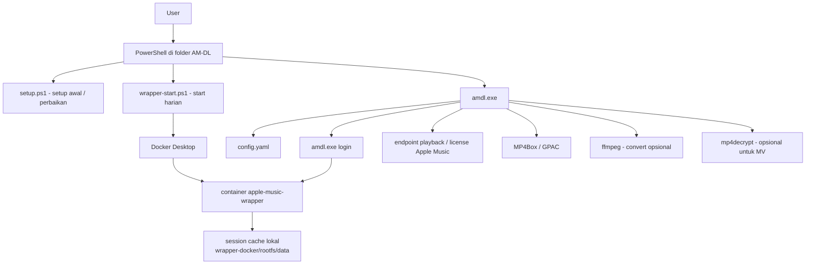
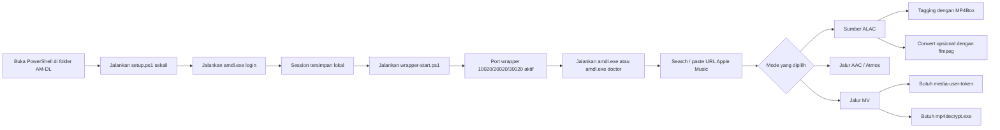

# AM-DL

Workspace downloader Apple Music yang dibuat lebih ramah pemula untuk Windows.

[🇺🇸 English](./README.md) | [🇮🇩 Bahasa Indonesia](./README-ID.md)

## Isi repository ini

Repo ini disusun supaya pengguna pemula lebih cepat bisa jalan.

File/folder penting:

- `amdl.exe` — binary Windows yang sudah dibuild untuk quick start
- `config.yaml` — config awal dengan nilai placeholder yang aman
- `setup.ps1` — helper setup/build/check
- `wrapper-login.ps1` — helper login Apple Music
- `wrapper-start.ps1` — helper start/stop/status backend wrapper
- `start.bat` — start wrapper lalu buka `amdl`
- `download.bat` — helper cepat untuk command download
- `client/` — source code Go untuk aplikasi
- `wrapper-docker/` — bundle runtime Docker untuk backend
- `wrapper-src/` — bundle source/reference yang tetap disimpan karena masih bisa berguna untuk flow advanced/manual
- `tools/` — folder lokal opsional untuk binary seperti `mp4decrypt.exe`

Backend yang didukung:

- `WorldObservationLog/wrapper`

## Arsitektur sistem



### Flow detail



## Requirement (wajib dibaca dulu)

### Wajib untuk pemakaian normal

- Windows
- Docker Desktop terpasang dan sedang jalan
- MP4Box / GPAC terpasang
- langganan Apple Music aktif
- repo ini sudah diextract ke folder biasa (bukan masih dibuka dari preview ZIP)

### Wajib hanya kalau mau build ulang dari source

- Go

### Opsional / advanced

- `ffmpeg`
- `media-user-token` untuk MV / AAC-LC / beberapa fitur lirik
- `mp4decrypt.exe` untuk Music Video

### Catatan penting soal Go

Kalau file `amdl.exe` sudah ada di folder, kamu **tidak perlu install Go** hanya untuk memakai aplikasi.

`amdl doctor` akan memberi tahu bagian mana yang masih kurang.

## Cara buka PowerShell di folder yang benar

Ini sangat penting. Error pemula paling sering terjadi karena PowerShell dibuka di folder yang salah.

### Cara paling gampang (disarankan)

1. Buka File Explorer
2. Buka folder AM-DL kamu
3. Klik address bar
4. Ketik:

```text
powershell
```

5. Tekan Enter

PowerShell akan langsung terbuka di folder yang benar.

### Cara manual

Kalau folder AM-DL kamu misalnya ada di `E:\AM-DL`, jalankan:

```powershell
cd "E:\AM-DL"
```

Kalau path kamu ada spasi, selalu pakai tanda kutip.

Benar:

```powershell
cd "C:\Users\Nama Kamu\Downloads\AM-DL"
```

Salah:

```powershell
cd C:\Users\Nama Kamu\Downloads\AM-DL
```

### Cara cek apakah sudah di folder yang benar

Jalankan:

```powershell
dir
```

Kamu harus bisa lihat file seperti:

- `setup.ps1`
- `amdl.exe`
- `wrapper-login.ps1`
- `wrapper-start.ps1`
- `README.md`

Kalau file-file itu tidak muncul, berarti kamu masih ada di folder yang salah.

---

## Jalur tercepat untuk pemula

Kalau kamu mau jalur paling singkat:

```powershell
Set-ExecutionPolicy -Scope Process -ExecutionPolicy Bypass
.\setup.ps1
.\amdl.exe login
.\wrapper-start.ps1
.\amdl.exe doctor
.\amdl.exe
```

Kalau kamu menjalankan script PowerShell pemula dengan double-click, sekarang window akan tetap terbuka di akhir supaya tidak langsung hilang.

Untuk pemakaian advanced dari terminal yang sudah terbuka:

```powershell
.\setup.ps1 -NoPause
.\wrapper-login.ps1 -NoPause
.\wrapper-start.ps1 -NoPause
```

Kalau kamu juga mau fitur MV / AAC-LC:

```powershell
.\amdl.exe token set
```

lalu taruh `mp4decrypt.exe` di salah satu lokasi ini:

- di samping `amdl.exe`
- `tools\mp4decrypt.exe`
- atau install ke `PATH`

---

## Pemakaian harian / saat mau menjalankan lagi

Kalau kamu sudah pernah setup sebelumnya, biasanya kamu **tidak perlu mulai dari nol lagi**.

Untuk pemakaian ulang sehari-hari, biasanya cukup jalankan:

```powershell
cd "FOLDER_AM-DL_KAMU"
.\wrapper-start.ps1
.\amdl.exe
```

Kalau mau cek dulu semua siap:

```powershell
.\wrapper-start.ps1 -Status
.\amdl.exe doctor
```

### Kapan perlu jalankan `setup.ps1` lagi?

Biasanya hanya kalau:

- `amdl.exe` hilang
- project dipindah ke PC/folder baru
- kamu mau build ulang dari source
- kamu mau regenerate/check setup lokal lagi

### Kapan perlu jalankan `amdl.exe login` lagi?

Biasanya hanya kalau:

- session lokal hilang
- kamu habis logout/reset session
- cache wrapper terhapus
- `amdl doctor` bilang login session missing

### Kapan perlu jalankan `amdl.exe token set` lagi?

Hanya kalau:

- kamu mau fitur MV / AAC-LC
- `media-user-token` berubah / expired
- config kamu di-reset dan token harus diisi lagi

### Versi singkat

Untuk pemakaian ulang biasa:

```powershell
cd "FOLDER_AM-DL_KAMU"
.\wrapper-start.ps1
.\amdl.exe
```

## Mode kualitas dan command

| Mode | Jenis source | Contoh command | Catatan |
|---|---|---|---|
| ALAC | Source lossless asli | `./amdl.exe "URL"` | Jalur lossless default |
| AAC | Jalur AAC asli | `./amdl.exe --aac "URL"` | Beberapa fitur AAC butuh `media-user-token` |
| Atmos | Jalur Atmos asli | `./amdl.exe --atmos "URL"` | Hanya jalan kalau title memang punya Atmos |
| Song only | Mode single track | `./amdl.exe --song "URL"` | Cocok untuk link lagu langsung |
| Search mode | Search interaktif | `./amdl.exe search album "Taylor Swift"` | User bisa pilih item dan kualitas secara interaktif |
| MV | Jalur Music Video | tergantung konten + token + `mp4decrypt.exe` | Untuk setup advanced |
| Output FLAC | Hasil convert | aktifkan `convert-after-download: true` dan `convert-format: flac` | FLAC adalah hasil convert dari ALAC via `ffmpeg`, bukan source asli |

Catatan:

- Source lossless asli di flow ini adalah **ALAC**, bukan FLAC.
- Output FLAC adalah **hasil convert**, bukan format source asli.
- Kalau kualitas yang diminta tidak tersedia untuk title tertentu, mode itu bisa gagal atau fallback tergantung jalurnya.

---

## Tutorial install detail sampai bisa dipakai

## Langkah 1 — Buka PowerShell di folder repo ini

Pastikan kamu sedang ada di folder repo ini.

Kamu harus bisa melihat file seperti:

- `amdl.exe`
- `setup.ps1`
- `wrapper-login.ps1`
- `wrapper-start.ps1`

Cek dengan:

```powershell
dir
```

## Langkah 2 — Izinkan script PowerShell lokal untuk sesi ini

Jalankan:

```powershell
Set-ExecutionPolicy -Scope Process -ExecutionPolicy Bypass
```

Ini hanya berlaku untuk window PowerShell yang sedang dipakai.

## Langkah 3 — Jalankan setup

Jalankan:

```powershell
.\setup.ps1
```

Yang dilakukan command ini:

- build `amdl.exe` kalau perlu
- menyiapkan image Docker wrapper
- menyiapkan flow config lokal

Kalau berhasil, biasanya akan muncul:

- `Setup complete`
- petunjuk next step yang mengarah ke `amdl.exe login`

## Langkah 4 — Login dengan akun Apple Music milikmu sendiri

Jalankan:

```powershell
.\amdl.exe login
```

Yang dilakukan command ini:

- menjalankan flow login wrapper
- memakai akunmu satu kali untuk bikin session/cache lokal
- **tidak** menyimpan password ke `config.yaml`

Kalau berhasil, session lokal akan tersimpan di:

```text
wrapper-docker/rootfs/data/
```

Kalau Apple minta 2FA, selesaikan di flow terminal tersebut.

## Langkah 5 — Nyalakan backend wrapper

Jalankan:

```powershell
.\wrapper-start.ps1
```

Kalau normal, port ini akan aktif di lokal:

- `127.0.0.1:10020`
- `127.0.0.1:20020`
- `127.0.0.1:30020`

Untuk cek status:

```powershell
.\wrapper-start.ps1 -Status
```

## Langkah 6 — Jalankan doctor check

Jalankan:

```powershell
.\amdl.exe doctor
```

Minimal yang kamu mau lihat:

- backend port reachable
- login session cached locally
- MP4Box available

Warning yang mungkin muncul:

- `media-user-token` missing → fitur MV / AAC-LC belum siap
- `mp4decrypt` missing → fitur Music Video belum siap

## Langkah 7 — Mulai pakai aplikasi

Jalankan:

```powershell
.\amdl.exe
```

Ini akan membuka menu interaktif.

Pilihan yang paling penting untuk pemula:

- Search & Download
- Download from URL
- Setup Wizard
- Login to Apple Music
- Doctor Check
- Backend Status

---

## Opsional: aktifkan fitur MV / AAC-LC

Fitur ini butuh setup tambahan.

## 1) Isi `media-user-token`

Jalankan:

```powershell
.\amdl.exe token set
```

Ini akan menyimpan token secara lokal ke `config.yaml`.

## 2) Tambahkan `mp4decrypt.exe`

Taruh binary asli di salah satu lokasi ini:

- `.\mp4decrypt.exe`
- `.\tools\mp4decrypt.exe`
- atau install global ke `PATH`

## 3) Verifikasi lagi

Jalankan:

```powershell
.\amdl.exe doctor
```

Kalau MV sudah siap penuh, seharusnya warning berikut hilang:

- `media-user-token`
- `mp4decrypt`
- `Music Video readiness`

---

## Command yang berguna

```powershell
.\setup.ps1
.\amdl.exe login
.\amdl.exe logout
.\amdl.exe token set
.\amdl.exe token clear
.\wrapper-start.ps1
.\wrapper-start.ps1 -Status
.\wrapper-start.ps1 -Logs
.\amdl.exe doctor
.\amdl.exe backend status
.\amdl.exe backend guide
.\amdl.exe config show
.\amdl.exe search song "Blinding Lights"
.\amdl.exe download https://music.apple.com/us/album/1989-taylors-version-deluxe/1713845538
```

---

## FAQ

### Apakah harus jalankan setup setiap kali?

Tidak. Biasanya hanya pertama kali, atau saat mau repair/rebuild setup.

### Kalau mau jalan lagi biasanya jalankan apa?

Biasanya cukup:

```powershell
cd "FOLDER_AM-DL_KAMU"
.\wrapper-start.ps1
.\amdl.exe
```

### Apakah harus install Go?

Hanya kalau mau build ulang dari source. Kalau `amdl.exe` sudah ada, Go tidak wajib untuk pemakaian biasa.

### Kenapa `setup.ps1` atau `amdl.exe` tidak dikenali?

Biasanya karena kamu ada di folder yang salah, atau lupa pakai prefix PowerShell `./`.

### Kenapa PowerShell langsung hilang?

Script pemula sekarang sudah pause saat selesai/error. Kalau jalan dari terminal yang sudah terbuka, pakai `-NoPause`.

### Kenapa `mp4decrypt` masih warning?

Karena binary-nya belum ada di `PATH`, di samping `amdl.exe`, atau di `tools\mp4decrypt.exe`.

### Kenapa MV belum ready walau sudah login?

Karena Music Video juga butuh `media-user-token` yang valid dan `mp4decrypt.exe`.

### Apakah FLAC itu source aslinya?

Bukan. Di flow ini source lossless aslinya ALAC. FLAC adalah hasil convert ALAC dengan `ffmpeg`.

## Troubleshooting

## Masalah: `amdl.exe` atau script tidak dikenali

Di PowerShell harus pakai prefix yang benar:

```powershell
.\amdl.exe doctor
```

bukan:

```powershell
.amdl.exe doctor
```

## Masalah: backend port unreachable

Cek:

```powershell
.\wrapper-start.ps1 -Status
```

Kalau belum jalan, start lagi:

```powershell
.\wrapper-start.ps1
```

Pastikan juga Docker Desktop sedang hidup.

## Masalah: login session missing

Jalankan:

```powershell
.\amdl.exe login
```

## Masalah: Music Video belum ready

Biasanya kamu masih kurang salah satu dari ini:

- `media-user-token` valid
- `mp4decrypt.exe`

Jalankan:

```powershell
.\amdl.exe doctor
```

lalu lihat warning baris mana yang masih muncul.

---

## Catatan

- `config.yaml` di repo ini adalah starter file dengan placeholder aman
- session/cache lokal disimpan di `wrapper-docker/rootfs/data`
- data session itu adalah data runtime lokal dan tidak boleh ikut ter-commit dengan kredensial pribadi
- `wrapper-docker/` adalah jalur runtime utama untuk pemula
- `wrapper-src/` tetap disimpan karena kamu memang minta folder itu ikut dipublikasikan untuk kebutuhan advanced/reference

## Release automation

Repo ini juga punya:

- `.github/workflows/release.yml`

Workflow ini bisa build bundle release Windows portable berisi:

- `amdl.exe`
- helper scripts
- `config.example.yaml`
- quickstart docs
- `wrapper-docker/`
