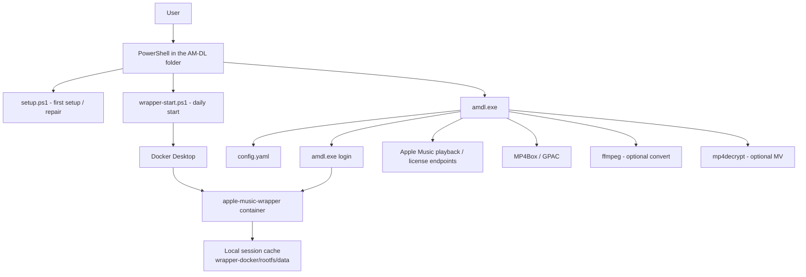
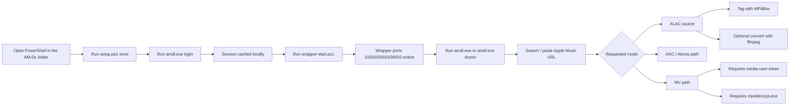

# AM-DL

Beginner-friendly Apple Music downloader workspace for Windows.

[🇺🇸 English](./README.md) | [🇮🇩 Bahasa Indonesia](./README-ID.md)

## What this repository contains

This repo is set up so beginners can get started faster.

Important files and folders:

- `amdl.exe` — prebuilt Windows binary for quick start
- `config.yaml` — starter config with safe placeholder values
- `setup.ps1` — builds/checks the local setup
- `wrapper-login.ps1` — Apple Music login helper
- `wrapper-start.ps1` — starts/stops/checks the backend wrapper
- `start.bat` — starts wrapper, then opens `amdl`
- `download.bat` — quick helper for direct download command forwarding
- `update.ps1` / `update.bat` — updater that refreshes this folder from GitHub without recloning
- `client/` — Go source code for the app
- `wrapper-docker/` — Docker runtime bundle for the supported backend
- `wrapper-src/` — source/reference bundle kept in the repo because it may still be useful for advanced/manual workflows
- `tools/` — optional local folder for binaries like `mp4decrypt.exe`

Supported backend target:

- `WorldObservationLog/wrapper`

## System architecture



### Detailed flow



## Requirements (read this first)

### Required for normal use

- Windows
- Docker Desktop installed and running
- MP4Box / GPAC installed
- an active Apple Music subscription
- this repo extracted to a normal folder (not still inside a ZIP preview)

### Required only if you want to rebuild from source

- Go

### Optional / advanced

- `ffmpeg`
- `media-user-token` for MV / AAC-LC / some lyric-related features
- `mp4decrypt.exe` for Music Video support

### Important note about Go

If `amdl.exe` is already present in the folder, you do **not** need Go just to use the app.

`amdl doctor` will tell you which parts are still missing.

## How to open PowerShell in the correct folder

This is very important. Most beginner errors happen because PowerShell is opened in the wrong folder.

### Easy method (recommended)

1. Open File Explorer
2. Open your AM-DL folder
3. Click the address bar
4. Type:

```text
powershell
```

5. Press Enter

PowerShell will open directly in the correct folder.

### Manual method

If your AM-DL folder is, for example, `E:\AM-DL`, run:

```powershell
cd "E:\AM-DL"
```

If your path contains spaces, always use quotes.

Correct:

```powershell
cd "C:\Users\Your Name\Downloads\AM-DL"
```

Wrong:

```powershell
cd C:\Users\Your Name\Downloads\AM-DL
```

### How to confirm you are in the right folder

Run:

```powershell
dir
```

You should see files like:

- `setup.ps1`
- `amdl.exe`
- `wrapper-login.ps1`
- `wrapper-start.ps1`
- `README.md`

If you do **not** see those files, you are in the wrong folder.

---

## Fastest beginner path

If you want the shortest possible path:

```powershell
Set-ExecutionPolicy -Scope Process -ExecutionPolicy Bypass
.\setup.ps1
.\amdl.exe login
.\wrapper-start.ps1
.\amdl.exe doctor
.\amdl.exe
```

If you double-click the beginner PowerShell scripts, they now stay open at the end so the window does not instantly disappear.

Advanced usage from an existing terminal:

```powershell
.\setup.ps1 -NoPause
.\wrapper-login.ps1 -NoPause
.\wrapper-start.ps1 -NoPause
```

If you want MV / AAC-LC features too:

```powershell
.\amdl.exe token set
```

and place `mp4decrypt.exe` in one of these locations:

- next to `amdl.exe`
- `tools\mp4decrypt.exe`
- anywhere in `PATH`

---

## Daily use / the next time you open AM-DL

If you have already completed setup before, you usually do **not** need to start from zero again.

For normal repeat usage, usually just do this:

```powershell
cd "YOUR_AM-DL_FOLDER"
.\wrapper-start.ps1
.\amdl.exe
```

If you want to check everything first:

```powershell
.\wrapper-start.ps1 -Status
.\amdl.exe doctor
```

### When do you need `setup.ps1` again?

Usually only if:

- `amdl.exe` is missing

## How to update without recloning

If you are using the ready-to-run folder/binary bundle, you do **not** need to clone the repo again just to get updates.

Use one of these:

```powershell
.\amdl.exe update
```

To check whether an update exists without downloading anything:

```powershell
.\amdl.exe update --check
```

or:

```powershell
.\update.bat
```

What the updater does:

- downloads the latest `main` branch ZIP from GitHub
- replaces bundled files like `amdl.exe`, scripts, docs, `client/`, and wrapper sources
- keeps your existing `config.yaml`
- keeps your local wrapper session cache under `wrapper-docker/rootfs/data`
- tries to run `setup.ps1` afterward if Docker Desktop is ready

If you prefer the script directly, you can also run:

```powershell
.\update.bat -CheckOnly
```

After updating, run:

```powershell
.\wrapper-start.ps1
.\amdl.exe doctor
```

If you cloned the repo with Git instead of using the prebuilt folder, you can still use normal Git commands:

```powershell
git pull
```
- you moved the project to a new PC or folder
- you want to rebuild from source
- you want to regenerate/check the local setup again

### When do you need `amdl.exe login` again?

Usually only if:

- the local session is missing
- you logged out/reset the session
- the wrapper cache was deleted
- `amdl doctor` says the login session is missing

### When do you need `amdl.exe token set` again?

Only if:

- you want MV / AAC-LC features
- your `media-user-token` changed or expired
- you cleared your config and need to enter the token again

### Short version

For most day-to-day usage:

```powershell
cd "YOUR_AM-DL_FOLDER"
.\wrapper-start.ps1
.\amdl.exe
```

## Quality modes and commands

| Mode | Source type | Command example | Notes |
|---|---|---|---|
| ALAC | Native lossless source | `./amdl.exe "URL"` | Default lossless path |
| AAC | Native AAC path | `./amdl.exe --aac "URL"` | Some AAC-related features may need `media-user-token` |
| Atmos | Native Atmos path | `./amdl.exe --atmos "URL"` | Only works if the title provides Atmos |
| Song only | Single-track mode | `./amdl.exe --song "URL"` | Useful for direct song links |
| Search mode | Interactive search | `./amdl.exe search album "Taylor Swift"` | Lets the user choose item and quality interactively |
| MV | Music Video path | depends on content + token + `mp4decrypt.exe` | Advanced setup only |
| FLAC output | Converted output | set `convert-after-download: true` and `convert-format: flac` | FLAC is converted from ALAC via `ffmpeg`, not native source |

Notes:

- Apple Music lossless source in this flow is **ALAC**, not FLAC.
- FLAC output is a **conversion result**, not the original source format.
- If a requested quality is unavailable for a title, that mode may fail or fall back depending on the path.

---

## Detailed install guide (step by step)

## Step 1 — Open PowerShell in this folder

Make sure you are inside this repo folder.

You should see files like:

- `amdl.exe`
- `setup.ps1`
- `wrapper-login.ps1`
- `wrapper-start.ps1`

You can confirm with:

```powershell
dir
```

## Step 2 — Allow local PowerShell scripts for this session

Run:

```powershell
Set-ExecutionPolicy -Scope Process -ExecutionPolicy Bypass
```

This only affects the current PowerShell window.

## Step 3 — Run setup

Run:

```powershell
.\setup.ps1
```

What this does:

- builds `amdl.exe` if needed
- prepares the wrapper Docker image
- prepares the local config flow

When it succeeds, you should see something like:

- `Setup complete`
- next steps mentioning `amdl.exe login`

## Step 4 — Log in with your own Apple Music account

Run:

```powershell
.\amdl.exe login
```

What this does:

- opens the wrapper login flow
- uses your account one time to create a local session/cache
- does **not** store your password in `config.yaml`

After success, the session is cached locally under:

```text
wrapper-docker/rootfs/data/
```

If Apple asks for 2FA, complete it in the terminal flow.

## Step 5 — Start the backend wrapper

Run:

```powershell
.\wrapper-start.ps1
```

This should expose these ports locally:

- `127.0.0.1:10020`
- `127.0.0.1:20020`
- `127.0.0.1:30020`

To check status:

```powershell
.\wrapper-start.ps1 -Status
```

## Step 6 — Run doctor check

Run:

```powershell
.\amdl.exe doctor
```

You want to see at least:

- backend ports reachable
- login session cached locally
- MP4Box available

Possible warnings:

- `media-user-token` missing → MV / AAC-LC features not ready yet
- `mp4decrypt` missing → Music Video support not ready yet

## Step 7 — Start using the app

Run:

```powershell
.\amdl.exe
```

This opens the interactive menu.

Main beginner actions:

- Search & Download
- Download from URL
- Setup Wizard
- Login to Apple Music
- Doctor Check
- Backend Status

---

## Optional: enable MV / AAC-LC features

These features need extra setup.

## 1) Set `media-user-token`

Run:

```powershell
.\amdl.exe token set
```

This stores the token locally in `config.yaml`.

## 2) Add `mp4decrypt.exe`

Put the real binary in one of these places:

- `.\mp4decrypt.exe`
- `.\tools\mp4decrypt.exe`
- or install it globally in `PATH`

## 3) Verify again

Run:

```powershell
.\amdl.exe doctor
```

For full MV readiness, the doctor output should no longer warn about:

- `media-user-token`
- `mp4decrypt`
- `Music Video readiness`

---

## Useful commands

```powershell
.\setup.ps1
.\amdl.exe login
.\amdl.exe logout
.\amdl.exe token set
.\amdl.exe token clear
.\wrapper-start.ps1
.\wrapper-start.ps1 -Status
.\wrapper-start.ps1 -Logs
.\amdl.exe doctor
.\amdl.exe backend status
.\amdl.exe backend guide
.\amdl.exe config show
.\amdl.exe search song "Blinding Lights"
.\amdl.exe download https://music.apple.com/us/album/1989-taylors-version-deluxe/1713845538
```

---

## FAQ

### Do I need to run setup every time?

No. Usually only the first time, or when repairing/rebuilding the setup.

### What do I usually run next time?

Usually just:

```powershell
cd "YOUR_AM-DL_FOLDER"
.\wrapper-start.ps1
.\amdl.exe
```

### Do I need Go installed?

Only if you want to rebuild from source. If `amdl.exe` already exists, Go is not required for normal use.

### Why is `setup.ps1` or `amdl.exe` not recognized?

You are probably in the wrong folder, or you forgot the PowerShell `./` prefix.

### Why does PowerShell close too quickly?

The beginner scripts now pause on completion/error. If you run from an existing terminal, use `-NoPause`.

### Why is `mp4decrypt` still a warning?

Because the binary is not present in `PATH`, beside `amdl.exe`, or in `tools\mp4decrypt.exe`.

### Why is MV still not ready even after login?

Music Video support also needs a valid `media-user-token` and `mp4decrypt.exe`.

### Is FLAC the original source?

No. In this flow, original lossless source is ALAC. FLAC is produced by converting ALAC with `ffmpeg`.

## Troubleshooting

## Problem: `amdl.exe` or script is not recognized

Use the normal PowerShell prefix:

```powershell
.\amdl.exe doctor
```

and not:

```powershell
.amdl.exe doctor
```

## Problem: backend ports are unreachable

Check:

```powershell
.\wrapper-start.ps1 -Status
```

If not running, start it again:

```powershell
.\wrapper-start.ps1
```

Also confirm Docker Desktop is running.

## Problem: login session missing

Run:

```powershell
.\amdl.exe login
```

## Problem: Music Video still not ready

You still need one or both of:

- a valid `media-user-token`
- `mp4decrypt.exe`

Run:

```powershell
.\amdl.exe doctor
```

and check the exact warning line.

---

## Notes

- `config.yaml` in this repo is a starter file with placeholder values
- local session/cache is stored under `wrapper-docker/rootfs/data`
- that session data is local runtime data and should not be committed with personal credentials
- `wrapper-docker/` is the beginner runtime path
- `wrapper-src/` is kept because you explicitly wanted it included for advanced/reference use

## Release automation

This repo includes:

- `.github/workflows/release.yml`

It can build a Windows portable release bundle containing:

- `amdl.exe`
- helper scripts
- `config.example.yaml`
- quickstart documentation
- `wrapper-docker/`
